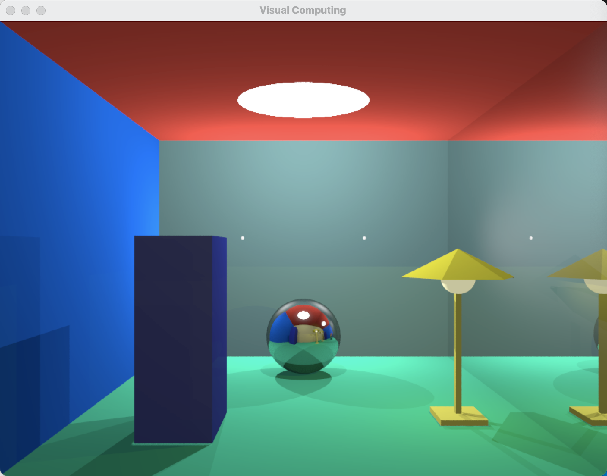
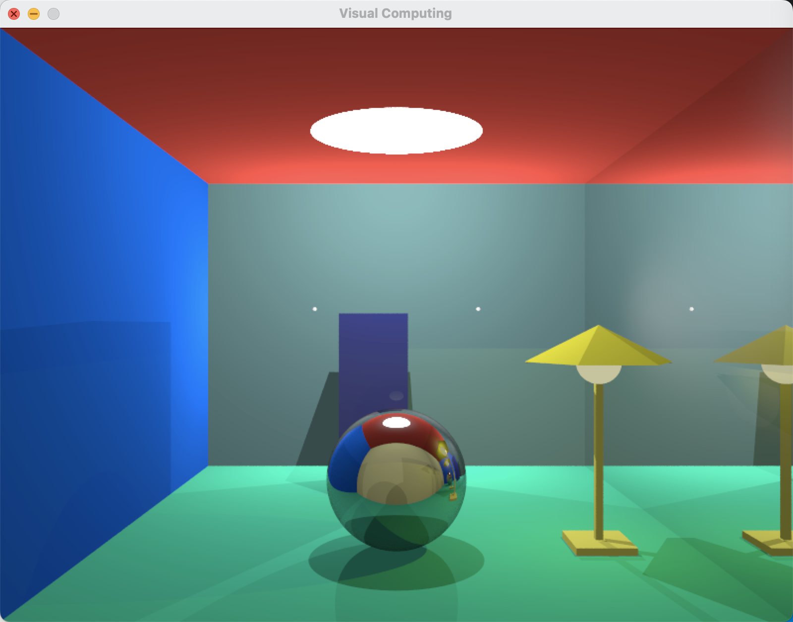
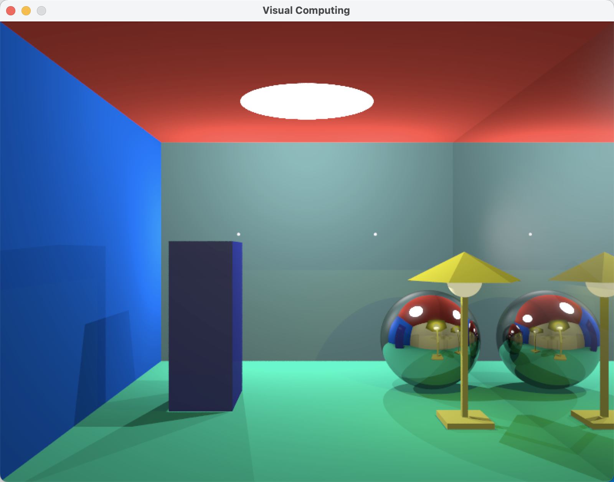
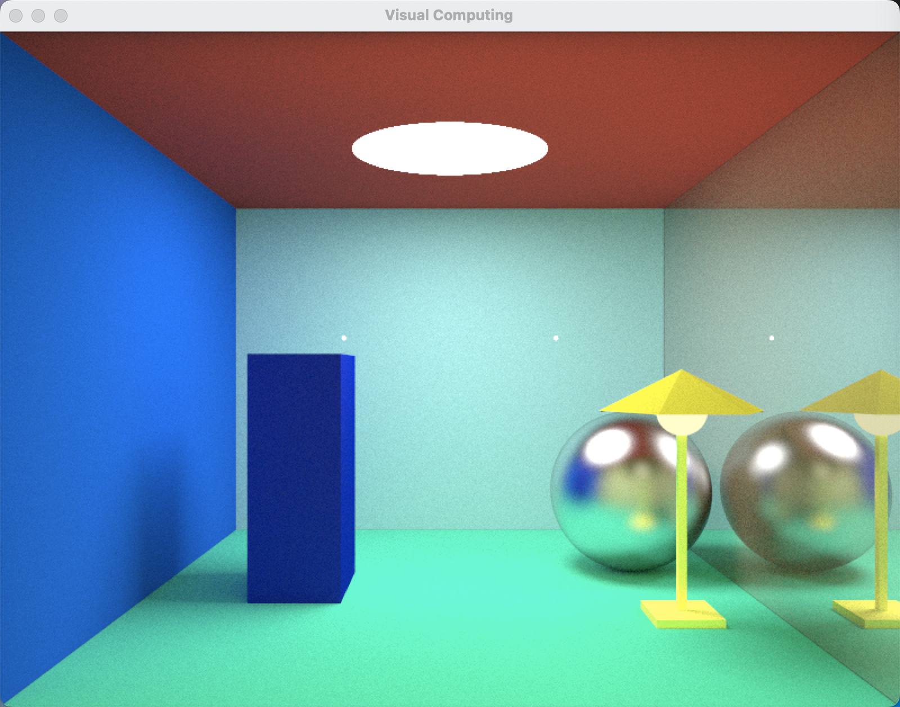

### 项目依赖

+ c++编译器
+ [xmake](https://xmake.io/#/)：项目构建工具，参考[官方文档](https://xmake.io/#/guide/installation)安装 


### 编译与运行

编译命令：

```
xmake f -m release
xmake
```

* 重复编译出错时可以使用`xmake clean`清空缓存
* `xmake f -m debug`可以切换到debug模式，切换之后需要运行`xmake -r`重新编译
* xmake会自动下载所需要的第三方库文件并链接到项目中，如果下载过程中遇到网络问题，有如下解决方式：
  - 可运行`xmake g --proxy_pac=github_mirror.lua`将github.com重定向到hub.fastgit.xyz
  - 可运行`xmake g --pkg_searchdirs=<download-dir>`并根据报错提示手动下载
  - 打开本地代理，使用命令行设置好环境变量`HTTPS_PROXY="127.0.0.1:<port>"`，之后在命令行中运行`xmake`

运行命令：

```
xmake run
```

编译生成的二进制程序在`bin`目录下，也可以进入`bin`目录下手动执行


### 效果实现

#### 基本要求

都实现了，具体细节如下：

+ 物体

  + 立方体一个，球体一个，落地灯一个（由六个三角形面组成的伞状灯罩+发光灯球+立方体细长柱+立方体底座）——共三种形状
  + 颜色分别为有轻微反光的紫色、金属材质、黄色——共三种不同颜色

+ 墙体

  + 共有五面颜色各异的纯色墙体 + 一面镜面墙

+ 光源

  + 吊顶一个面光源(用点光源+球体来模拟)
  + 正面的墙上两个点光源
  + 落地灯有一个球形光源

+ 场景生成

  + 共有三种场景，等比例随机选择，立方体和球体的位置随场景变换
  + 落地灯的位置和两个点光源的位置每次在指定范围内随机生成，球体的大小在固定范围内随机生成
  + 相机位姿固定

+ 遮挡

  + 物体和墙体间必形成遮挡
  + 落地灯的灯罩和发光灯球必形成遮挡
  + 其他物体在不同模式下可能形成不同的遮挡

  

#### 升级要求

共提供两种渲染模式：ray-tracing和path-tracing，在`main.cpp`中修改来选择

实现了阴影、镜面反射、软阴影(path-tracing)、面光源、间接光照（反弹次数默认为10【ray-tracing】和5【path-tracing】）


### 结果展示

#### ray-tracing

简单、快速，大约15s之后就达到效果，但是阴影效果不太自然








#### path-tracing

渲染时间较长，大约半个小时降噪基本完成，但是颜色和阴影过渡更为自然，整体效果更加真实

5分钟后


40分钟后



